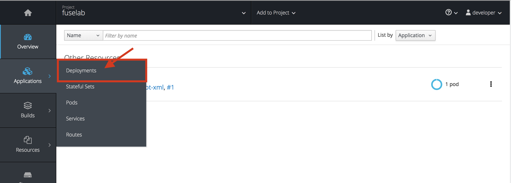
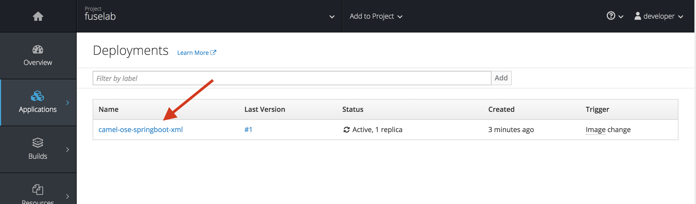

To view the status of our build, go back to the Dashboard, on the lefthand side menu, hover over *Builds* and click on *Builds*. 

And here you can monitor the status of your build on the platform. 

After the build succeeds, move onto deployment, here you will see the deployment status of your application. (On lefthand side menu, select *Applications* and *Deployments*)

All deployments in this project will be displayed here. 

Click Overview on the lefthand side menu. This page will display the list of application that is running in the project. You can find overall details about each application on this page. For instance, number of pods running this application. Image used to spin up the pod, the source code (if available). etc..

For more detailed view of your application, lets go to the Fuse Hawtio console.
This includes standard JVM resources such as memory and threads as well as JMX attributes and operations. The console also provides a full selection of tools used to drill into the Fuse implmentation.

To get there, click on the running POD in your overview page. 
You will be taken directly to the pod *detail page*. Below the *Template* section on the page you will find a link named "Open Java Console". Go ahead and click it

This provides better insight into the application and it's current status. You will be able to see the current statistics of your application.  Select the *Route Diagram* to see a more detailed implementation:

The Route Diagram tab provides a graphical review of all the routes currently deployed in our API application.  After selecting this tab we should see something similar to what is pictured below.

Once done, close the console by clicking the back link as shown below and then head back to our terminal:

Now lets tracing that output out our application in the log console. Click on the Logs tab on the top of the page.

You will be able to see the output of the application. 

Congratulations! You have completed your first Fuse application on OpenShift.

