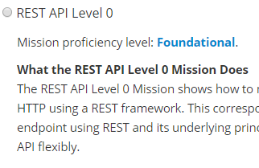
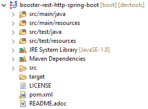

# Download the initial project

While the [Spring Initializr](https://start.spring.io) tool very handy for creating Spring Applications quickly, there would still be some configuration required on our side to get the project into a ready state for OpenShift. Luckily OpenShift provides a tool that will allow us to skip these additional steps when generating a Spring Boot application that's destined for OpenShift deployment!

**1. Introducing the RHOAR Launcher** 
The Red Hat OpenShift Application Runtime (RHOAR) Launcher is a tool that will allow us to generate a Spring Boot application with the exact configurations that we need to plug into OpenShift in as few steps as possible. It's a quick and easy-to-follow multi-step process that can be found [here](https://launch.openshift.io/launch/filtered-wizard/all). It will require an OpenShift account, so make sure that you have your login information handy.

To get started, simply click the `Launch Your Project` button.

**2. Running through the Launcher**
The first section that we run into is asking about Deployment type. The `OpenShift Online` deployment will take multiple steps for you, creating a github repository with all of the new project's code and automatically hooking up Continuous Delivery on the newly created respository's master branch. That's pretty powerful! But for learning purposes, we're going to stick with the second option to `Build and run locally`. Click the button to continue.

The next page is introducing us to a few different types of base projects known as "Missions". They're simple projects that have been created with a mission in mind, one simple function that they wish to convey to the user. For simplicity's sake, we're going to choose the `REST API Level 0` mission, a basic application which will just respond to the user through a simple REST API. Select the radio button and click Next:



The next choice is Runtime. Since we're sticking with Spring Boot, this one is an easy choice. Click Spring Boot and then Next.


This screen will ask for project information. We can keep the defaults and click Next again.

This brings us to the review page. If everything looks good, go ahead and click the `Download as ZIP file` button to get your base project locally. 

**3. Load project into STS**

Now that we have our project downloaded let's load it into an IDE for further modification. Since we're using a Spring application we're going to be using `Spring Tool Suite`(STS) for our IDE, which is an Eclipse-based development environment that's been customized specifically for Spring application development. You can download STS [here](https://spring.io/tools/sts/all) and can read about some of the benefits and features [here](https://spring.io/tools/sts).

After installing STS we need to load up our Spring Initializr project. Click `File` and `Open Projects from File System...`.


From there simply click the `Directory...` button and navigate to the downloaded project folder. Click `Finish` and STS will load the project for you. If everything went successfully, we should end up with a file structure that looks like this:



**4. Spring Initializr vs Launcher**

If you downloaded a Spring Initializr project on the previous step you can take a look and see some of the differences between the two generated projects.

Other than the application code, some of the main differences are the addition of a `fabric8` folder and multiple changes in the pom file. 

Many of the changes in the pom files are simply adding references for the dependencies, but we've also added a profile specifically for OpenShift that looks like this:

```xml
    <profile>
      <id>openshift-it</id>
      <build>
        <plugins>
          <plugin>
            <groupId>org.apache.maven.plugins</groupId>
            <artifactId>maven-failsafe-plugin</artifactId>
            <configuration>
              <systemPropertyVariables>
                <app.name>${project.artifactId}</app.name>
              </systemPropertyVariables>
            </configuration>
          </plugin>
        </plugins>
      </build>
      <activation />
    </profile>
```

As for the `fabric8` folder, it contains one file named `route.yml` which contains metadata about the project:

```json
apiVersion: v1
kind: Route
metadata:
  name: ${project.artifactId}
spec:
  port:
    targetPort: 8080
  to:
    kind: Service
    name: ${project.artifactId}
```

There's also a very useful ``README.adoc``{{open}} file included that gives more detail about the application and the process required to modify and test it. Check out [this link](https://appdev.openshift.io/docs/spring-boot-runtime.html) for more information about Spring Boot within a Fabric8 launcher context.


## Congratulations

You have now successfully executed the second step in this scenario. In next step we will go over one option to deploy our application to the OpenShift Container Platform via Fabric8. This example is extremely simple as it is meant to only introduce you to Spring Boot and RHOAR.
