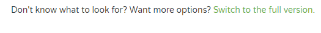

# Download the initial project

When developing a Spring application a great place to start is with the [Spring Initializr](https://start.spring.io) tool. The website will allow you to select from a few simple settings and choose different libraries to include to help you get started with a skeleton Spring application that's ready to go!

Go ahead and navigate to the [Spring Initializr](https://start.spring.io) tool and switch your view to the full version by clicking the link: 



Scrolling down we can start to see a number of libraries that Spring can automatically include with your download when selected. Since we're going to be using a skeleton application we don't need to include any additional dependencies. Keep all of the other default settings and click the `Generate Project` button to generate a zip file that contains our fully set up application. All that's left is to navigate to the download location and begin unzipping the file. 

Now that we have our project downloaded let's load it into an IDE for further modification. Since we're using a Spring application we're going to be using `Spring Tool Suite`(STS) for our IDE, which is an Eclipse-based development environment that's been customized specifically for Spring application development. You can download STS [here](https://spring.io/tools/sts/all) and can read about some of the benefits and features [here](https://spring.io/tools/sts).

After installing STS we need to load up our Spring Initializr project. Click `File` and `Open Projects from File System...`.


From there simply click the `Directory...` button and navigate to the downloaded project folder. Click `Finish` and STS will load the project for you. If everything went successfully, we should end up with a file structure that looks like this:


Now our project has been loaded into STS and it's ready to modify. If we wanted to add any additional dependencies or libraries after the initalize step, we can do so by going into the pom file and adding them manually.

<!-- You can also verify by running the ``tree``{{execute}} command.

```sh
.
├── pom.xml
└── src
    ├── main
    │   ├── java
    │   │   └── com
    │   │       └── example
    │   │           └── demo
    │   │               └── DemoApplication.java
    │   └── resources
    │       └── application.properties
    └── test
        └── java
            └── com
                └── example
                    └── demo
                        └── DemoApplicationTests.java
``` -->

## Congratulations

You have now successfully executed the first step in this scenario. In next step we will go over one option to deploy our application to the OpenShift Container Platform. This example is extremely simple as it is meant to only introduce you to Spring Boot and RHOAR.