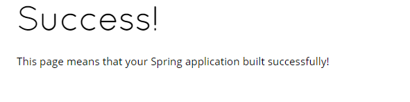

# Deploy to OpenShift Application Platform

**1. Deploy the application to OpenShift**

Run the following command to deploy the application to OpenShift

``mvn package fabric8:deploy -Popenshift``{{execute}}

There's a lot that happens here so lets break it down:

The `mvn package` piece of the above command instructs Maven to run the package lifecycle. This builds a Spring Boot JAR file which is a Fat Jar containing all dependencies necessary to run our application.

For the deployment to OpenShift we are using the [Fabric8](https://fabric8.io/) tool through the `fabric8-maven-plugin` which is configured in our ``pom.xml``{{open}} (found in the `<profiles/>` section). Configuration files for Fabric8 are contained in the `src/main/fabric8` folder mentioned earlier.

After the Maven build has finished, it will typically take less than 20 sec for the application to be available. To verify that everything is started run the following command and wait for it to report that the replication controller successfully rolled out:

``oc rollout status dc/rhoar-training``{{execute}}

You should see output in the console similar to `replication controller "rhoar-training" successfully rolled out`. If you take another look at your OpenShift web view, you should see that your application now displays on the Overview page.

**2. Connection to the application via the Route**

Now that our application is deployed to OpenShift, how do external users access it? The answer is with a route. By using a route, we are able to expose our services and allow for external connections at a given hostname. Open the OpenShift web view and we can see the route that was created for our application. Navigate to the Overview page and expand our deployment tab. Under the `ROUTES External Traffic` section we should see our provided route.

Either click on the route link through the OpenShift web view, or click this link [here](http://rhoar-training-dev.[[HOST_SUBDOMAIN]]-80-[[KATACODA_HOST]].environments.katacoda.com/).

We should now see the same `Success` page that we saw when we first tested our app locally:

## Congratulations

You have now learned how to deploy a Spring Boot application to OpenShift Container Platform, as well as access the application via an external route. In our next step, we will navigate through OpenShift's web console in order to view our application and learn about health checks.